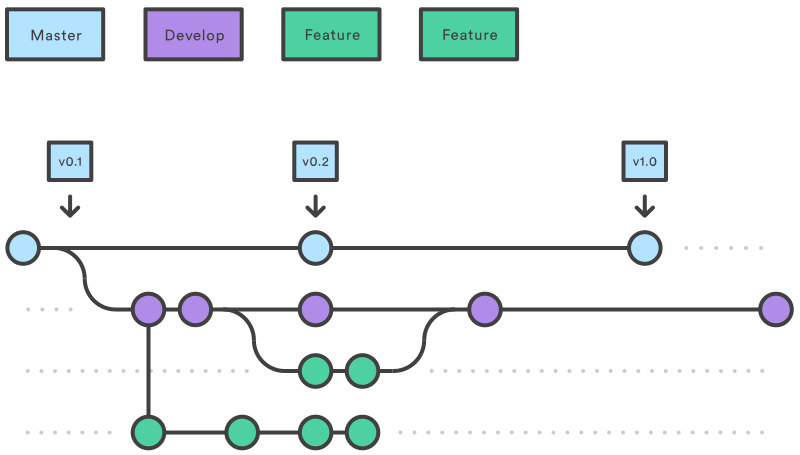
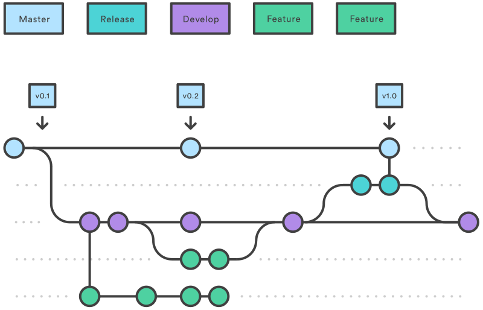
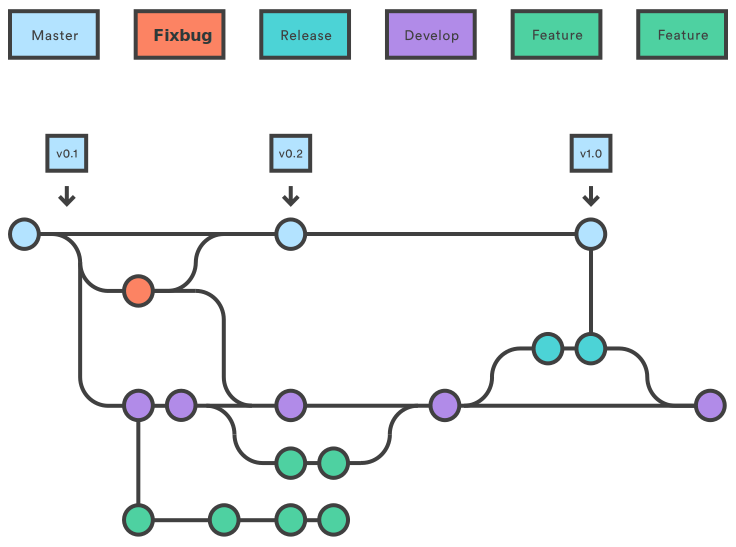

### Git使用规范
团队开发中，遵循一个合理、清晰的Git使用流程，是非常重要的。
否则，每个人都提交一堆杂乱无章的commit，项目很快就会变得难以协调和维护。

#### 分支管理策略
master用于正式发布，develop用于日常开发。
以上两个分支属于项目的必备分支。
另外还有一些开发过程中用到的分支，属于临时性的分支，
包括：功能分支、预览分支、维护分支。
这三种分支使用完以后，应该删除，使得代码库的分支始终只有master和develop

**主分支 master**

master分支中保留完全稳定的代码，即已经发布的代码，这是一个受保护的分支，开发人员不允许push代码。

**开发分支 develop**
开发中用到的分支，开发人员开发完的某个功能，向develop分支发起合并请求。develop也是受保护的分支，开发人员不允许push代码。

("./images/02.svg")

**功能分支 feature**
每个新功能位于一个新的分支，这样可以push到远程服务器以备份和协作。功能分支不是从master分支上fork出的分支，而是从develop上fork出的分支。当新功能开发完成时，合并回develop分支。命名方式：feature-功能名称或开发人员名-功能名称。


**预览分支 release**
该分支是在功能开发完后发布到测试系统进行测试的分支，测试完成后合并到master分支，并且新建版本号。命名方式 release-测试版本号


**维护分支 fixbug**
该分支是用于修复正式版发布后出现的bug, 是直接从master或develop分支fork出来的分支。修复完合并回原分支，然后在master分支新建版本号。命名方式fixbug-bug名称


-------

#### 开发操作流程
> 1. 开发人员克隆项目到本地，切换到develop分支上创建自己的功能分支。
> 2. 在自己的分支上编码，提交并推送到远程服务器上自己的分支。
> 3. 创建一个合并请求，从自己的分支合并到develop分支，指定审核人。
> 4. 团队的管理员审查并且决定是否合并员工提交的分支到develop分支上，如代码有问题拒绝合并，开发人员修改代码，重新发起合并请求。
> 5. 功能开发完，从develop分支合并到release分支，把release分支发布到测试环境进行测试。
> 6. 测试完成，合并代码到master，新建版本号，发布到正式环境。

以上步骤对于一些比较小的项目来说可能有些繁琐，比如只有一两个开发人员的项目，这时候需要团队的管理员把develop设置为非保护分支，可以直接在develop分支上开发和提交代码，以下是简化的操作流程：
> 1. 开发人员克隆项目到自己本地，切换到develop分支。
> 2. 在本地develop分支上编码，提交并推送到远程服务器上的develop分支。
> 3. 功能开发完，从develop分支合并到release分支，把release分支发布到测试环境进行测试。
> 4. 测试完成，合并代码到master，新建版本号，发布到正式环境。

#### 多人开发的注意事项
开发过程中如果有两个人以上开发人员开发同一个功能，其中一人开发完部分功能，发起合并请求到develop，其他开发人员如果没有获取最新的代码发起合并请求，有时会出现冲突不能合并。有两种方式处理冲突。

**1.开发人员处理**
其他开发人员重新拉取develop分支的代码，合并develop分支到当前分支，处理完冲突后重新推送到服务器，然后就可以处理合并。

```
//切换到develop分支，拉取远程服务器最新的代码。
git checkout develop
git pull

//切换到自己的分支，合并develop分支到当前分支
git checkout <mybranch>
git rebase develop

//处理完冲突文件后，标记冲突已解决,继续rebase
git add -u
git rebase --continue
```

**2.审核人处理**
审核人拉取最新的代码，合并代码到develop分支，处理冲突推送到远程服务器的develop分支。

```
//获取最新代码，切换分支
git fetch origin
git checkout -b <branchname> origin/<branchname>

//处理冲突合并分支
git checkout develop
git merge --no-ff <branchname>
//推送到远端服务器
git push origin develop
```
